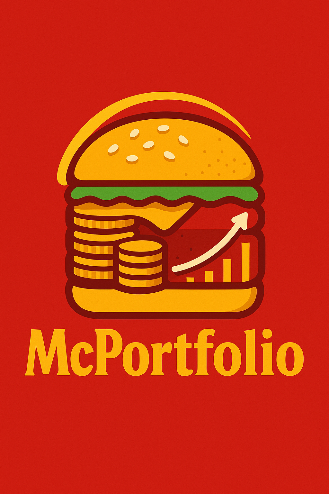

// Modified by Edward Brandler, based on original files from PyPortfolioOpt and USolver

# McPortfolio - LLM-Driven Portfolio Optimization

<p align="center">
    
</p>

This project allows users work with advanced portfolio optimization using natural language, without writing code. 

**Overview of Portfolio Optimizers:**

Portfolio optimizers are algorithms and mathematical tools designed to help investors allocate their capital among different assets in a way that balances risk and return. The most common approaches include:

- **Mean-Variance Optimization (Markowitz):** Finds the portfolio with the lowest risk for a given expected return, or the highest return for a given risk, based on historical means and covariances.
- **Maximum Sharpe Ratio:** Seeks the portfolio with the best risk-adjusted return, maximizing the Sharpe ratio.
- **Minimum Volatility:** Focuses on constructing the portfolio with the lowest possible volatility.
- **Efficient Frontier:** The set of optimal portfolios that offer the highest expected return for a defined level of risk.
- **Black-Litterman Model:** Combines market equilibrium with investor views to produce more stable and realistic portfolios.
- **Hierarchical Risk Parity (HRP):** Uses clustering algorithms to build diversified portfolios that are robust to estimation errors.
- **Mean-CVaR and Mean-Semivariance:** Alternative risk measures that focus on downside risk or tail risk, rather than standard deviation.

These optimizers allow users to tailor their portfolios to their specific risk tolerance, investment goals, and market views.

It gives a universal solver interface for Model-Constraint-Problem (MCP). It makes the [PyPortfolioOpt](https://pyportfolioopt.readthedocs.io/en/latest/) library's features available to Large Language Models (LLMs) through an MCP Server. The main goal is to let .

This project builds on the open-source [USolver](https://github.com/sdiehl/usolver) project, which gives a Model Context Protocol server with tools for different optimization problems. Through USolver, this project works with this powerful solver:

*   [`cvxpy`](https://www.cvxpy.org/) - Used for convex optimization problems in portfolio theory, like maximizing Sharpe ratio or minimizing volatility with linear and quadratic constraints.

## Important Points for LLM-Driven Optimization

The LLM's ability to pick the right solver, parameters, and variables for an optimization problem is a judgment call. It is affected by the non-deterministic nature of LLMs.

**Users should check both the LLM's assumptions and the output.**

### How to Check:
*   **Review the LLM's prompt and generated code/parameters**: Before running, look at the input the LLM is making for the MCP server.
*   **Check server logs**: The MCP server gives detailed logs of operations and parameters used. Review these logs to make sure they match your goals.
*   **Compare with PyPortfolioOpt documentation**: If you know PyPortfolioOpt, check the LLM's chosen parameters and objectives against the library's official docs.
*   **Look at the output metrics**: Check the expected annual return, annual volatility, Sharpe ratio, and other performance metrics to make sure they make sense for your problem.

## Claude Project Instructions

To improve performance and use McPortfolio properly, add the contents of `docs/Claude_Project_Instructions.md` to your Claude project's knowledge section. These instructions give:

1. A system prompt that guides Claude to use the MCP server well
2. Clear rules on when and how to use the portfolio optimization tools
3. Standard templates for different types of optimization requests
4. Error handling and backup steps
5. Example interactions and expected responses

The instructions help Claude to:
- Find when a request fits MCP's features
- Make proper requests using the standard JSON format
- Check outputs against financial best practices
- Give clear explanations of its optimization choices

## An overview of classical portfolio optimization methods

*Reproduced and adapted from [PyPortfolioOpt by robertmartin8](https://github.com/robertmartin8/PyPortfolioOpt?tab=readme-ov-file#an-overview-of-classical-portfolio-optimization-methods)*

Harry Markowitz's 1952 paper is the undeniable classic, which turned portfolio optimization from an art into a science. The key insight is that by combining assets with different expected returns and volatilities, one can decide on a mathematically optimal allocation which minimises the risk for a target return – the set of all such optimal portfolios is referred to as the efficient frontier.


Although much development has been made in the subject, more than half a century later, Markowitz's core ideas are still fundamentally important and see daily use in many portfolio management firms. The main drawback of mean-variance optimization is that the theoretical treatment requires knowledge of the expected returns and the future risk-characteristics (covariance) of the assets. Obviously, if we knew the expected returns of a stock life would be much easier, but the whole game is that stock returns are notoriously hard to forecast. As a substitute, we can derive estimates of the expected return and covariance based on historical data – though we do lose the theoretical guarantees provided by Markowitz, the closer our estimates are to the real values, the better our portfolio will be.

Thus this project provides four major sets of functionality (though of course they are intimately related):

- Estimates of expected returns
- Estimates of risk (i.e covariance of asset returns)
- Objective functions to be optimized
- Optimizers

A key design goal of PyPortfolioOpt is modularity – the user should be able to swap in their components while still making use of the framework that PyPortfolioOpt provides.

## Portfolio Optimization Examples

The server provides two main endpoints for portfolio optimization. Here are comprehensive examples for different scenarios:

### 1. Basic Portfolio Optimization

```python
# Example 1: Simple minimum volatility portfolio
{
    "description": "Build a minimum volatility portfolio",
    "tickers": ["AAPL", "MSFT", "NVDA", "GOOGL", "META"],
    "constraints": ["max_weight 0.3"],  # No single stock exceeds 30%
    "objective": "minimize_volatility"
}

# Example 2: Maximum Sharpe ratio portfolio
{
    "description": "Build a maximum Sharpe ratio portfolio",
    "tickers": ["AAPL", "MSFT", "NVDA", "GOOGL", "META"],
    "constraints": ["max_weight 0.3"],
    "objective": "maximize_sharpe_ratio"
}
```

### 2. Sector-Constrained Portfolio

```python
# Example: Diversified portfolio across major sectors
{
    "description": "Build a diversified portfolio across major sectors",
    "tickers": [
        # Technology
        "AAPL", "MSFT", "NVDA", "GOOGL", "META",
        # Financials
        "JPM", "V", "BAC", "GS", "AXP",
        # Healthcare
        "JNJ", "UNH", "PFE", "MRK", "ABBV",
        # Consumer
        "MCD", "PG", "KO", "WMT", "SBUX",
        # Energy
        "XOM", "CVX"
    ],
    "constraints": [
        "max_weight 0.15",     # No single stock exceeds 15%
        "sector_tech 0.35",    # Technology sector max 35%
        "sector_fin 0.35",     # Financial sector max 35%
        "sector_health 0.35",  # Healthcare sector max 35%
        "sector_cons 0.35",    # Consumer sector max 35%
        "sector_energy 0.35"   # Energy sector max 35%
    ],
    "objective": "minimize_volatility"
}
```

### 3. Risk-Constrained Portfolio

```python
# Example: Portfolio with risk constraints
{
    "description": "Build a portfolio with risk constraints",
    "tickers": ["AAPL", "MSFT", "NVDA", "GOOGL", "META", "JPM", "V", "JNJ", "UNH"],
    "constraints": [
        "max_weight 0.2",      # No single stock exceeds 20%
        "min_weight 0.05",     # Each stock must have at least 5%
        "max_volatility 0.15"  # Maximum portfolio volatility of 15%
    ],
    "objective": "maximize_sharpe_ratio"
}
```

### 4. Factor-Constrained Portfolio

```python
# Example: Portfolio with factor constraints
{
    "description": "Build a portfolio with factor constraints",
    "tickers": ["AAPL", "MSFT", "NVDA", "GOOGL", "META", "JPM", "V", "JNJ", "UNH"],
    "constraints": [
        "max_weight 0.2",           # No single stock exceeds 20%
        "min_weight 0.05",          # Each stock must have at least 5%
        "max_beta 1.2",             # Maximum portfolio beta of 1.2
        "min_momentum 0.1",         # Minimum momentum factor exposure
        "max_value 0.3"             # Maximum value factor exposure
    ],
    "objective": "maximize_sharpe_ratio"
}
```

### 5. Custom Risk Measures

```python
# Example: Portfolio with custom risk measures
{
    "description": "Build a portfolio with custom risk measures",
    "tickers": ["AAPL", "MSFT", "NVDA", "GOOGL", "META", "JPM", "V", "JNJ", "UNH"],
    "constraints": [
        "max_weight 0.2",           # No single stock exceeds 20%
        "max_cvar 0.1",             # Maximum Conditional Value at Risk of 10%
        "max_cdar 0.15",            # Maximum Conditional Drawdown at Risk of 15%
        "max_semivariance 0.12"     # Maximum semivariance of 12%
    ],
    "objective": "minimize_volatility"
}
```

### 6. Modern Portfolio Theory (USolver Example)

This project uses USolver for different optimization problems. Here's how it works for a Modern Portfolio Theory problem, turned by the language model into a convex optimization problem that `cvxpy` can solve:

```markdown
Goal: Get the highest expected portfolio return
Rules:

Bonds cannot be more than 40%
Stocks cannot be more than 60%
Real Estate cannot be more than 30%
Commodities cannot be more than 20%
All amounts must be zero or positive
Total must be exactly 100%
Total weighted portfolio risk cannot be more than 10%

Given Data:

Expected returns: Bonds 8%, Stocks 12%, Real Estate 10%, Commodities 15%
Risk factors: Bonds 2%, Stocks 15%, Real Estate 8%, Commodities 20%
```

The language model turns this into a convex optimization problem for `cvxpy`.

$$
\begin{align}
\text{maximize} \quad & 0.08x_1 + 0.12x_2 + 0.10x_3 + 0.15x_4 \\
\text{subject to} \quad & x_1 + x_2 + x_3 + x_4 = 1 \\
& x_1 \leq 0.4 \\
& x_2 \leq 0.6 \\
& x_3 \leq 0.3 \\
& x_4 \leq 0.2 \\
& 0.02x_1 + 0.15x_2 + 0.08x_3 + 0.20x_4 \leq 0.10 \\
& x_1, x_2, x_3, x_4 \geq 0
\end{align}
$$

Where:
- $x_1$ = Bonds amount
- $x_2$ = Stocks amount
- $x_3$ = Real Estate amount
- $x_4$ = Commodities amount

The answer is:

```markdown
Bonds: 30.0%
Stocks: 20.0%
Real Estate: 30.0% (at maximum allowed)
Commodities: 20.0% (at maximum allowed)
Maximum Expected Return: 10.8% annually
```

## Installation

You can install the project using:

```bash
uv run install.py
```

This will install all dependencies and development tools.

To uninstall the project:

```bash
uv run uninstall.py
```

This will remove the project and clean up build artifacts.

### Prerequisites

- Python 3.12 or higher
- [uv](https://github.com/astral-sh/uv) package manager
- Git

### Development Setup

1. Clone the repository:
   ```bash
   git clone https://github.com/ebrandler/mcportfolio
   cd mcportfolio
   ```

2. Create and activate a virtual environment:
   ```bash
   python -m venv .venv
   source .venv/bin/activate  # On Windows: .venv\Scripts\activate
   ```

3. Install development dependencies:
   ```bash
   uv pip install -e ".[dev]"
   ```

4. Install pre-commit hooks:
   ```bash
   pre-commit install
   ```

### Running the Server

**For Claude Desktop/MCP clients (stdio transport):**
```bash
uv run mcportfolio/server/main.py
```

**For HTTP/web deployment:**
```bash
uvicorn mcportfolio.server.main:asgi_app --host 0.0.0.0 --port 8001
```

The HTTP server will be available at `http://localhost:8001`

Test the HTTP server health:
```bash
curl http://localhost:8001/health
```

## Docker Usage

### Building the Image

1. Build the Docker image:
   ```bash
   docker build -t mcportfolio:latest .
   ```

2. Run the container:
   ```bash
   docker run -d -p 8001:8081 --name mcportfolio mcportfolio:latest
   ```

3. Check container status:
   ```bash
   docker ps
   docker logs mcportfolio
   ```

### Docker Compose (Optional)

For development with Docker Compose:

1. Start the services:
   ```bash
   docker-compose up -d
   ```

2. View logs:
   ```bash
   docker-compose logs -f
   ```

3. Stop services:
   ```bash
   docker-compose down
   ```

### Health Checks

The container includes a health check that runs every 30 seconds. You can monitor the health status:

```bash
docker inspect --format='{{.State.Health.Status}}' mcportfolio
```

## Development

### Code Quality

The project uses several tools to maintain code quality:

- `black` for code formatting
- `ruff` for linting
- `mypy` for type checking
- `pytest` for testing
- `pre-commit` hooks for automated checks

Run all checks:
```bash
pre-commit run --all-files
```

### Testing

Run tests with coverage:
```bash
pytest --cov=mcportfolio
```

Generate coverage report:
```bash
pytest --cov=mcportfolio --cov-report=html
```
